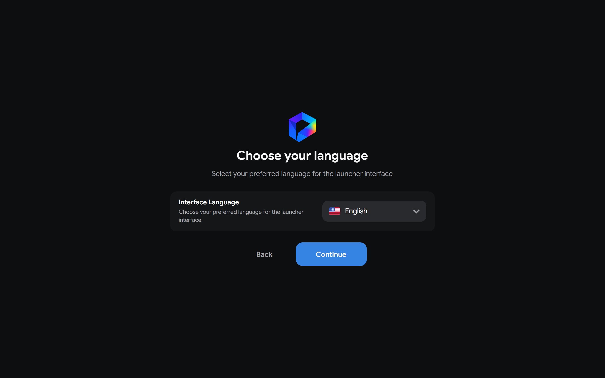
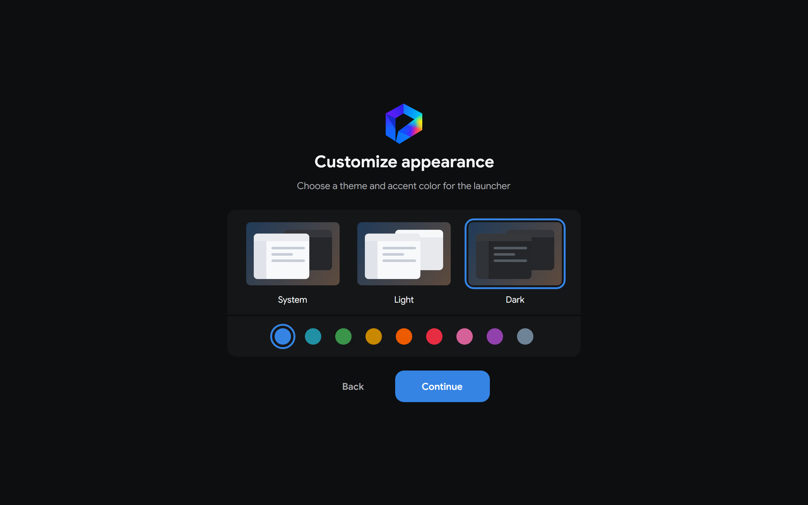
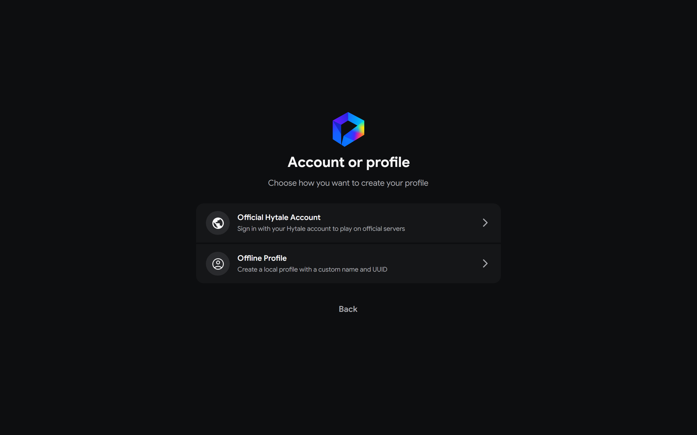
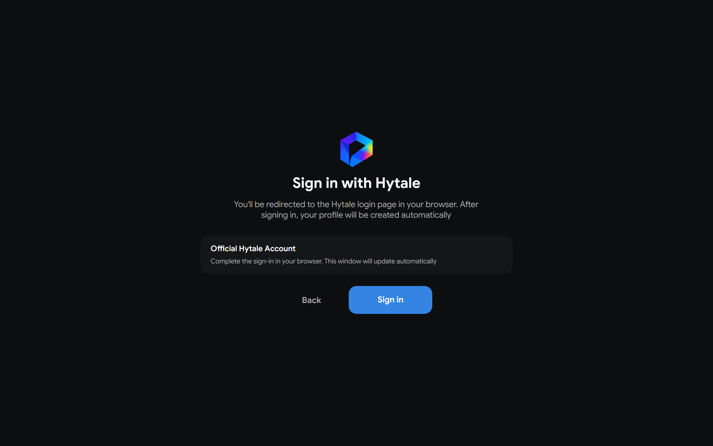
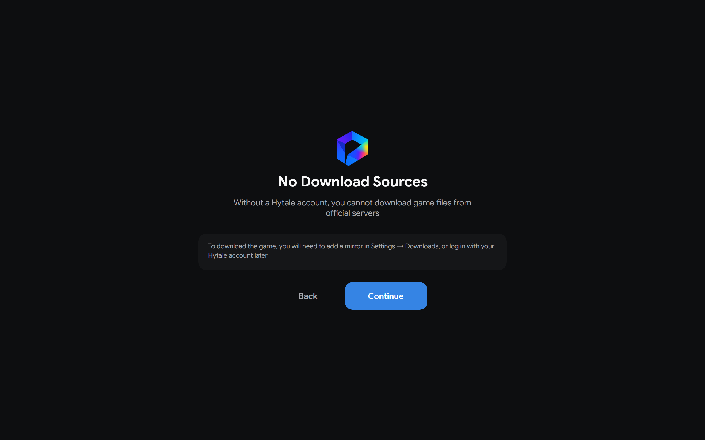
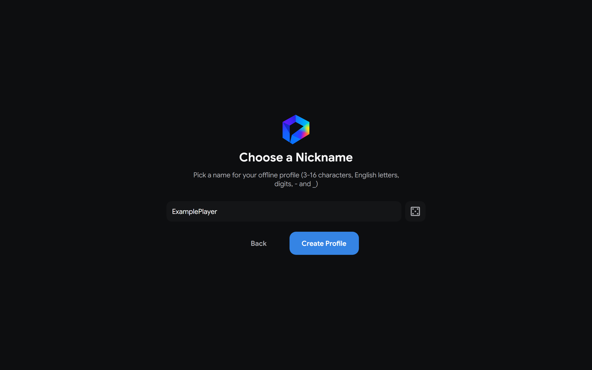

# First run

On a new installation, Hyprism opens the setup wizard after the loading screen. You need a player profile and a game instance before you can launch Hytale. Existing profiles or instances keep the launcher from reopening the wizard after an update.

If you used an older release that stored data in a `HyPrism` folder, the launcher moves it to `Hyprism` automatically when it starts. When both folders exist, see [Data and cache](/architecture/data-and-cache) for how their contents are combined.

## Complete the setup wizard

1. On **Welcome to Hyprism**, select **Continue**.
2. Choose the interface language. The wizard updates immediately.
3. Choose the launcher theme and accent color. You can change both later in **Settings → Visual**.
4. Choose **Official Hytale account** or **Offline profile**.

The language screen shows the current language and its flag.

The appearance screen previews each theme and shows the available accent colors.

The final selection offers the two profile types.

An **Official Hytale account** opens sign-in in your system browser and requires an entitled Hytale account. When sign-in succeeds, setup finishes.

An **Offline profile** needs a name of 3 to 16 ASCII letters, digits, hyphens, or underscores. On a new installation without an enabled mirror, Hyprism first warns that it has no download source. Select **Continue** to enter the name and create the profile. If a mirror was already enabled, the warning is skipped.

Without an official account or enabled mirror, you cannot list available builds or install the game. After setup, open **Settings → Downloads**, select **Add**, and add a source you trust. See [Download sources](/user-guide/settings#downloads) for the available methods.

See [Profiles](/user-guide/profiles) for authentication modes and profile management.

## Create and launch an instance

1. Open **Instances**, select **New Instance**, and choose a release branch and build.
2. Confirm creation. This adds an instance entry without downloading game files.
3. Open the instance and select **Launch**. Hyprism downloads the selected build, prepares the runtime, and starts the game when installation succeeds.

See [Instances](/user-guide/instances-profiles-mods) for installation, launch, and deletion behavior.

The defaults suit most systems. Before downloading, review **Settings → Java** if you need a custom Java executable or memory limits, **Settings → General → Game GPU** if you have multiple graphics adapters, and **Settings → Network** if you use an offline profile.
