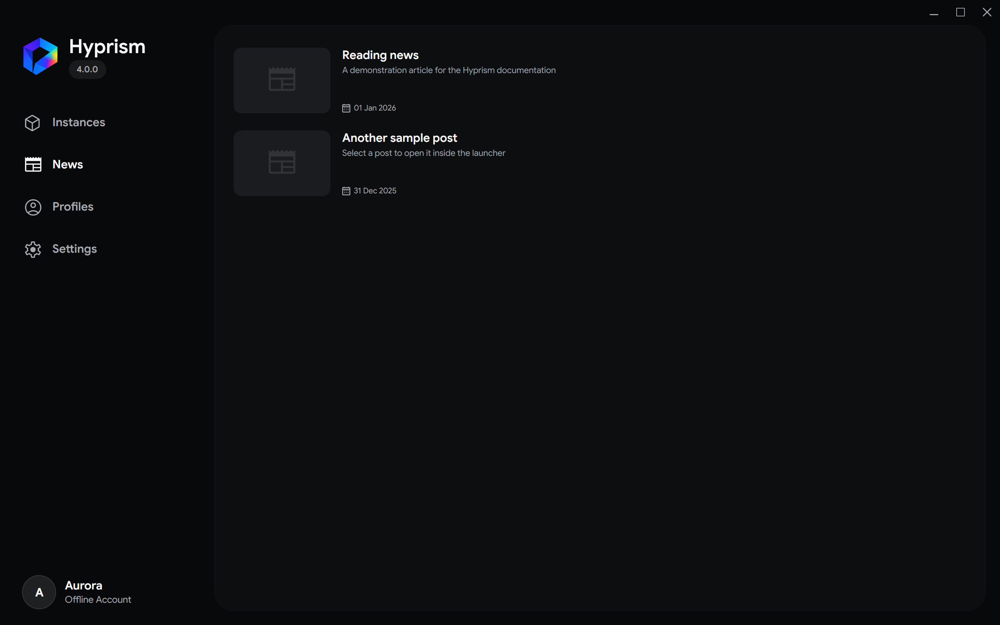
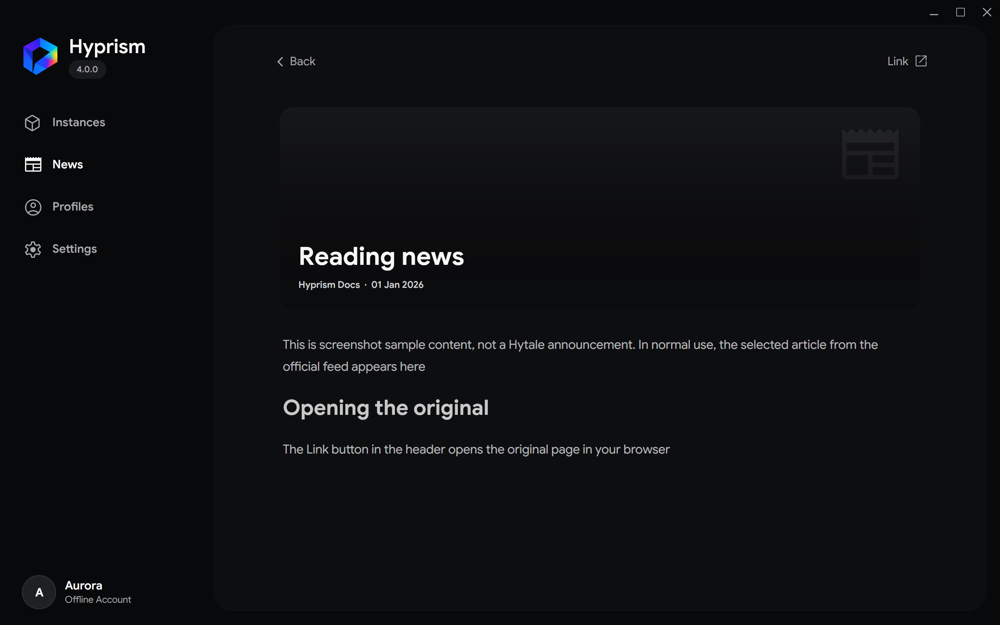

# News

The News page loads the official Hytale feed and opens articles inside Hyprism

These screenshots use sample articles to demonstrate the interface, not current Hytale announcements

## Read an article

1. Open **News**
2. Select an item in the feed
3. Use **Link** in the article header when you want the original page in your browser
4. Select **Load more** at the end of the feed to request older posts

On a compact window, **Back** returns from the article to the feed

Hyprism caches the parsed feed, opened articles, and their images. Cached content can open when the network is temporarily unavailable

YouTube videos embedded in an article appear as clickable previews in the reader. Select a preview to open the video in your default browser

The **Disable news** option in **Settings → Appearance** is not functional in the current desktop version
