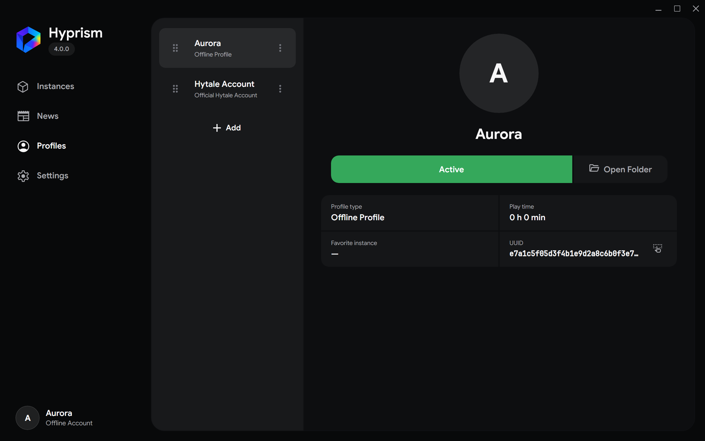

# Profiles

A profile is the player identity Hyprism uses when starting an instance. The active profile appears at the bottom of the navigation rail

## Create an offline profile

1. Open **Profiles** and select **Add**
2. Choose **Offline profile**
3. Enter a name from 3 to 16 ASCII letters, digits, hyphens, or underscores
4. Create the profile

Offline profiles can use a connected custom authentication service or the on-device [Local Node](/reference/local-node). They do not receive official entitlements, cloud identity, or centralized social features

## Add an official profile

1. Open **Profiles** and select **Add**
2. Choose **Official Hytale account**
3. Start sign-in
4. Complete authorization in the system browser
5. Return to Hyprism after the browser confirms success

Hyprism saves the profiles returned by the account and refreshes the session when required. Official game downloads and launches require an entitled account

## Select and manage profiles

- Select a card to view its type, play time, favorite instance, and UUID
- Select **Select** to use that profile for future launches
- Use **Copy UUID** when another tool needs the identity value
- Use **Open Folder** to inspect profile-specific files
- Open the three-dot menu to duplicate or delete a profile; editing is available for offline profiles only
- Drag the handle to save a different profile order

The active profile cannot be deleted. Select another profile first

:::warning
Do not share session files or authentication tokens from a profile directory. A bug report normally needs launcher logs, not account credentials
:::
