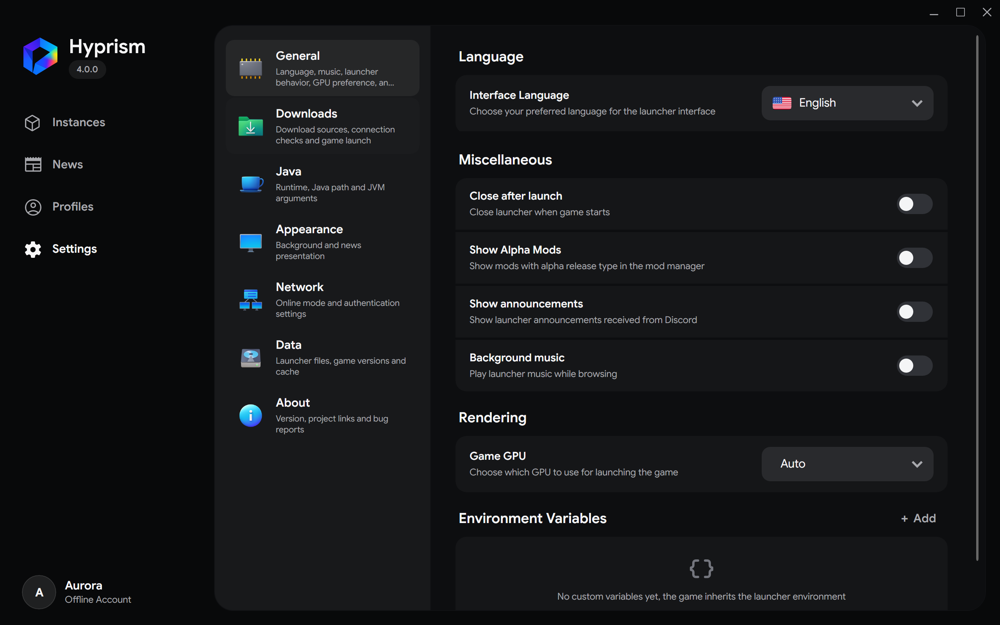
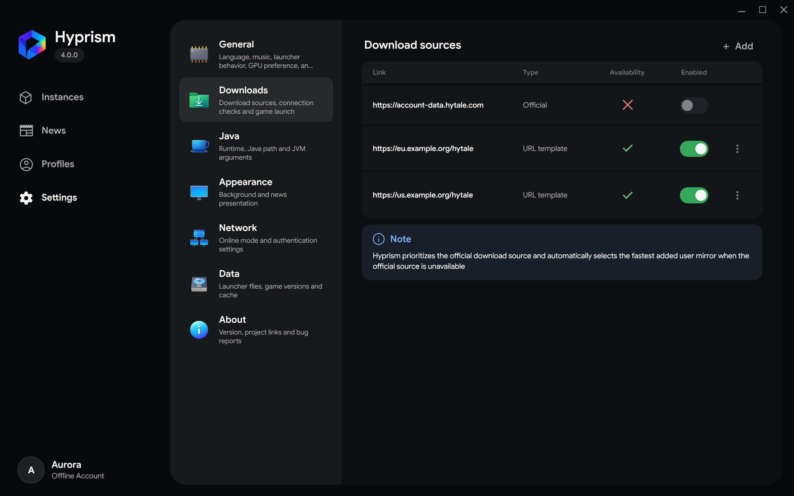

# Settings

Settings are grouped by purpose. Wide windows show categories beside their content, while compact windows use **Back** to return to the category list.

[](../../../static/img/user/en/settings-general.png)

## General

- **Interface Language** changes the launcher and official sign-in callback language immediately.
- **Close after launch** exits Hyprism after the game starts successfully.
- **Show Alpha Mods** includes prerelease files in mod search results.
- **Game GPU** chooses a detected graphics adapter or leaves the choice to the system with **Auto**.

**Show announcements** controls Discord announcements in the launcher. **Background music** enables or disables launcher background music.

[](../../../static/img/user/en/settings-gpu-picker.png)

### Environment variables

Environment variables are passed to every game process. Add one or more `KEY=VALUE` assignments. Quote a value when it contains spaces:

```text
MESA_VK_DEVICE_SELECT=10de:2786
MY_GAME_OPTION="value with spaces"
```

Invalid assignments are rejected. A custom value replaces a launcher-managed value when both use the same key.

## Downloads {/* #downloads */}

The official source is always available as a configuration entry. User-added mirrors are optional and can be enabled, disabled, or removed.

[](../../../static/img/user/en/settings-downloads.png)

To add a mirror, select **Add** and choose one method.

- **Automatic detection** accepts a public HTTPS endpoint and tries to infer its supported layout.
- **Manual setup** accepts a complete `.mirror.json` definition.

Hyprism validates the definition and checks whether each source has files for the current platform. It prefers the official source and selects the fastest available enabled mirror when the official source cannot serve the requested version.

:::warning
A mirror supplies executable game content and patches. Add only endpoints you trust and make sure their use complies with the [Hytale EULA](https://hytale.com/eula) and local law.
:::

The [mirror reference](/reference/mirrors) documents the format for advanced setups.

## Java {/* #java */}

Use the bundled runtime unless you need a specific compatible Java installation.

- **Use bundled Java** lets Hyprism provision and update its managed runtime.
- **Use custom Java** requires selecting the `java` or `java.exe` executable.
- **Maximum RAM (-Xmx)** and **Initial RAM (-Xms)** control the heap values generated by Hyprism.
- **Advanced JVM arguments** adds options for the singleplayer server through `JAVA_TOOL_OPTIONS`.

[](../../../static/img/user/en/java-arguments.png)

Enter each advanced option as a separate argument. Heap flags are managed by the memory controls and are rejected in this editor.

```text
-Dfile.encoding=UTF-8
-XX:+UnlockExperimentalVMOptions
```

Agent, classpath, Java-home, and executable-selection arguments are removed because they can bypass the launch setup.

## Appearance {/* #appearance */}

The Appearance category contains the **Disable news** switch. Enable it to prevent Hyprism from fetching and displaying news.

## Network {/* #network */}

This category affects offline profiles only.

- **Online mode** sends local-profile session requests to the configured authentication server.
- **Auth Server** lists the built-in session service and any user-added servers. Select a row to make it active, use **Add** to open the overlay dialog, then confirm the address after its response check succeeds, or remove a user-added row.
- The add dialog explains that the address is used for online authentication and shows an example placeholder. If the response check fails, the field turns red and the warning icon shows the reason on hover. Editing the address clears the error state.
- The table columns are **Link**, **Availability**, and **Ping**. Each row shows the same availability state style as Download sources, including the current response time when the server is online.
- The Auth Server list is hidden for official profiles and while Online mode is disabled.
- Disabling online mode uses the on-device [Local Node](/reference/local-node).

Official profiles always use official Hytale authentication. Local Node sessions do not grant official ownership or centralized social features.

## Data {/* #data */}

- **Instance folder** changes the root used for game installations.
- **Reset** moves instances back to the default location inside the Hyprism data directory.
- **Open folder** opens either the instance root or the complete launcher data directory.
- The storage chart groups instance files, mods, images, news, logs, and other data.

Changing the instance folder copies existing data, preserves Unix permissions where supported, and removes the previous folder only after success. The action is disabled while a game is running and can be canceled while copying.

Back up important worlds before moving a large instance directory or changing disks.

## About

About shows the installed version, latest `main` commit, project links, contributors, licenses, the Hytale EULA, and visual credits.

Use **Bug Report** to open the issue templates. Include your platform, Hyprism version, reproduction steps, expected result, actual result, and relevant logs.
