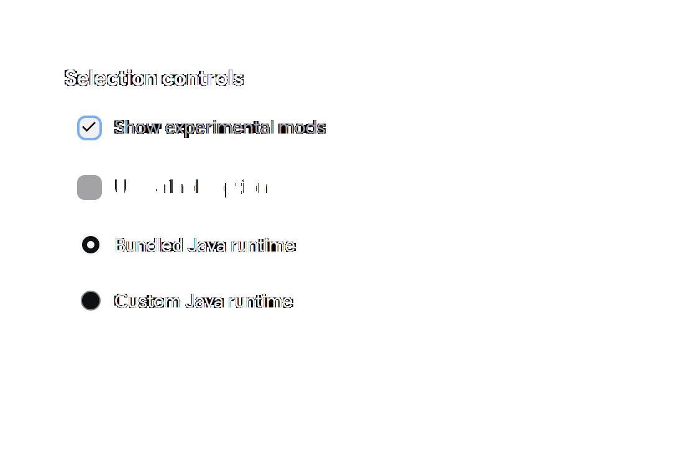
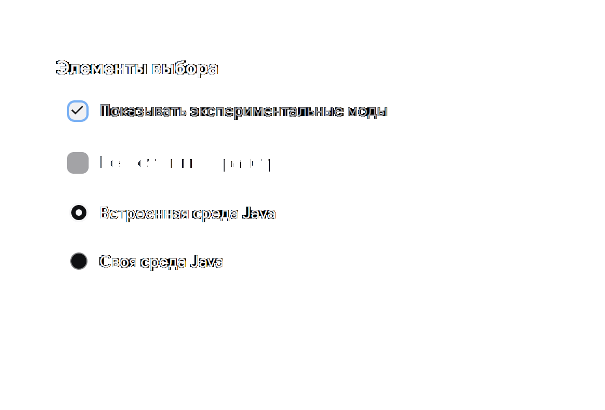
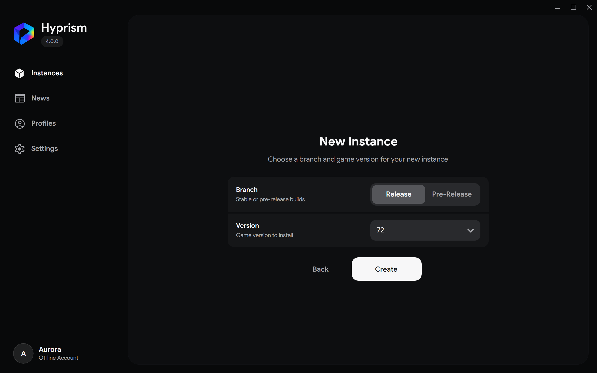
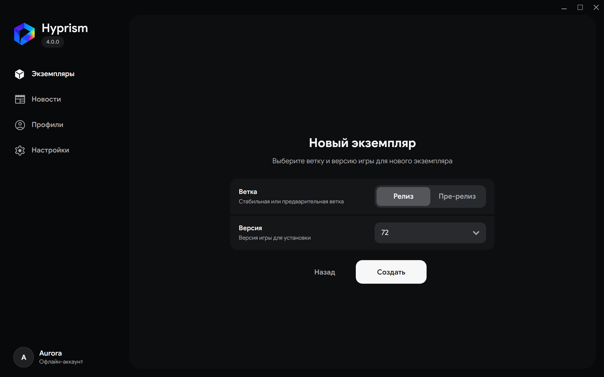
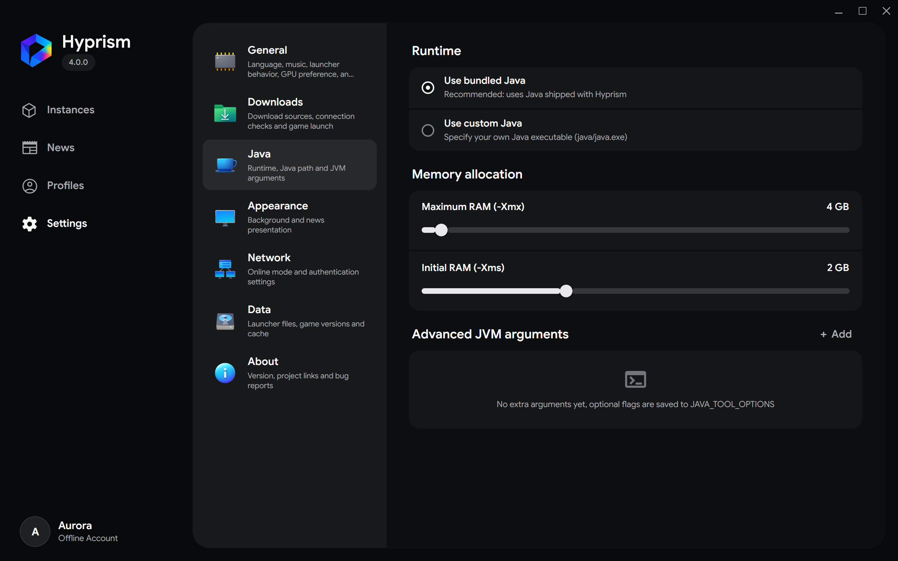
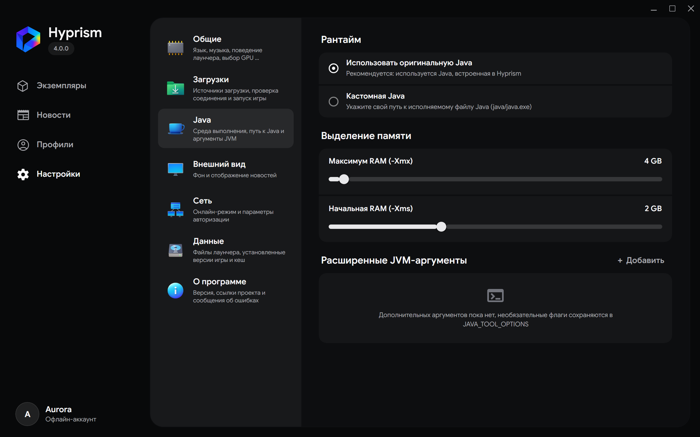
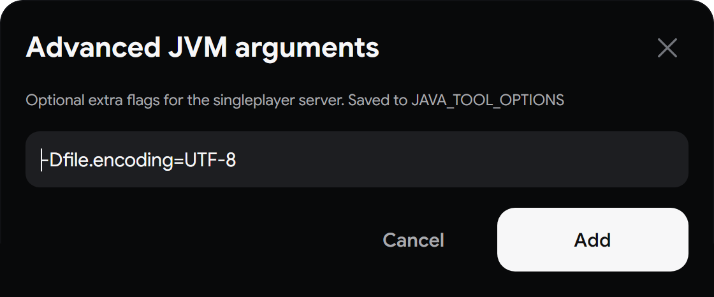
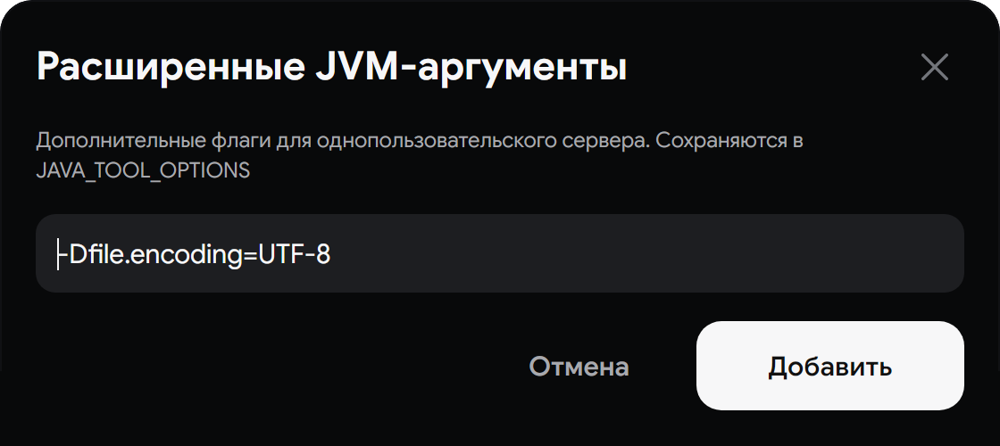
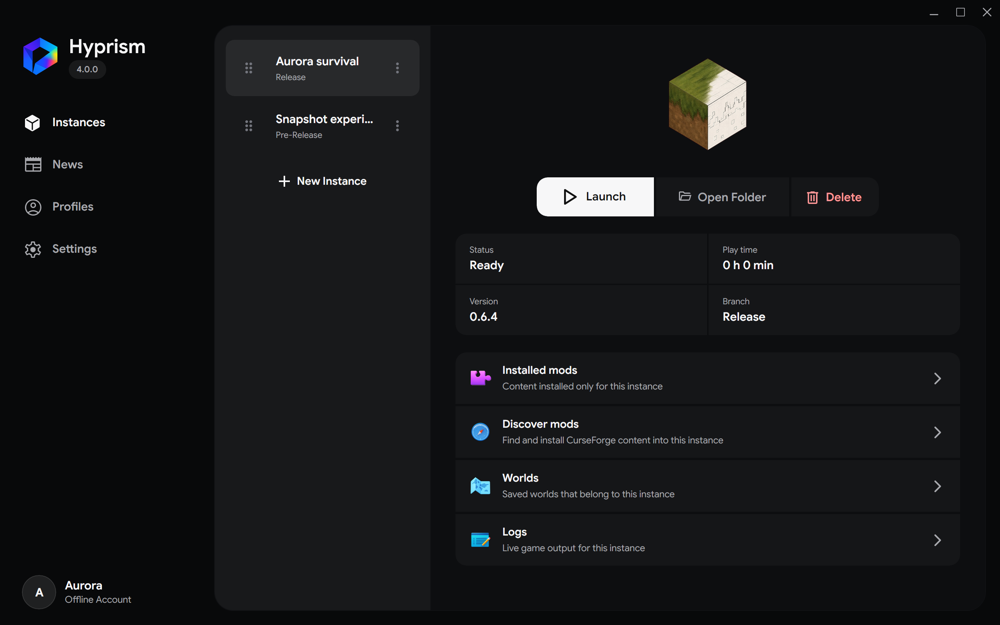

# Архитектура UI Desktop

Эта страница является контрактом сопровождения слоя Avalonia UI. Здесь описано, где размещать ресурс, как подключать общий компонент и какой слой отвечает за визуальное состояние.

## Модель ответственности

UI Desktop разделён на пять слоёв.

| Слой | Расположение | Ответственность |
| --- | --- | --- |
| Основа | `UI/Foundation` | Шаблоны темы, семантические кисти, примитивные размеры и глобальные селекторы |
| Компоненты | `UI/Components` и `UI/Controls` | Общие темы контролов, пользовательские контролы, примитивы компоновки и интерактивное поведение |
| Оболочка | `Shell` | Рамка окна, композиция навигации, поверхность запуска и ресурсы оболочки |
| Ресурсы экранов | `Screens/<Screen>` | DataTemplate и стили одного экрана или явно выделенного общего паттерна |
| Представления экранов | `Screens/<Screen>/*View.axaml` | Композиция, привязки, обработчики view-local событий и компоновка экрана |

Представление экрана владеет поведением. Переиспользуемый компонент владеет визуальным контрактом, который могут использовать несколько экранов. Токен владеет значением, которое должно меняться согласованно у нескольких потребителей.

## Цепочка ресурсов

`App.axaml` загружает ресурсы в следующем порядке.

| Порядок | Ресурс | Контракт |
| --- | --- | --- |
| 1 | `UI/Foundation/Tokens/Primitives.axaml` | Контекстно-независимые значения отступов, радиусов, размеров и типографики |
| 2 | `UI/Foundation/Tokens/Semantic.axaml` | Цвета продукта, поверхности, интерактивные состояния и статусные кисти |
| 3 | `UI/Components/ControlThemes.axaml` | Именованные темы системных контролов, включая `TransparentPageButton` и `ThinScrollThumb` |
| 4 | `Shell/WindowDecorations.axaml` | Ресурсы оформления окна |
| 5 | `UI/Foundation/Themes/HyprismTheme.axaml` | Шаблоны системных контролов приложения |
| 6 | `UI/Components/Components.axaml` | Селекторы общих контролов и шаблоны пользовательских контролов |
| 7 | `UI/Foundation/GlobalStyles.axaml` | Селекторы, действующие во всём приложении |
| 8 | `UI/Components/ManagerStyles.axaml` | Общие manager rail, действия с прогрессом, detail toolbar и placeholder загрузки |

Сохраняйте этот порядок. Шаблон темы должен быть загружен до селектора, который его настраивает, а словарь токенов до первого обращения к dynamic resource.

При одинаковом приоритете выигрывает более поздний совпавший стиль. Селекторы класса и псевдокласса имеют приоритет над простым селектором типа, а локальное значение XAML выше setter стиля. Размещайте базовые правила перед правилами состояний и поясняйте намеренные локальные переопределения общих ролей. См. [приоритет значений свойств в Avalonia](https://docs.avaloniaui.net/docs/properties/value-precedence).

## Каталог компонентов

### Пользовательские контролы

| Компонент | Расположение | Использование |
| --- | --- | --- |
| `EmptyState` | `UI/Controls/Primitives/EmptyState.cs` | Заголовок, описание, иконка и необязательное действие для пустой поверхности экрана |
| `NoteCard` | `UI/Controls/Primitives/NoteCard.cs` | Информационные и важные сообщения с общей иконкой и поверхностью |
| `FormRow` | `UI/Controls/Primitives/FormRow.cs` | Подпись, подсказка, необязательная ошибка и редактор в общей строке формы |
| `ModalForm` | `UI/Controls/Primitives/ModalForm.cs` | Заголовок, описание, содержимое, закрытие и слот действий модальной формы |
| `OverlayModal` | `UI/Controls/Primitives/OverlayModal.axaml` и `.axaml.cs` | Анимированная модальная панель, фон, обработка Escape и восстановление фокуса |
| `FadingPopup` | `UI/Controls/Primitives/FadingPopup.cs` | Всплывающие окна с согласованными переходами открытия и закрытия |
| `FadingComboBox` | `UI/Controls/Primitives/FadingComboBox.cs` | Выбор из списка с общим жизненным циклом popup |

### Примитивы компоновки и взаимодействия

| Компонент | Расположение | Использование |
| --- | --- | --- |
| `AdaptiveMasterDetailHost` | `UI/Controls/Interaction` | Широкое master-detail представление и компактная навигация к деталям |
| `WizardHost` | `UI/Controls/Interaction` | Владение шагами мастера, переходами и навигацией |
| `SmoothScrollViewer` | `UI/Controls/Primitives` | Прокрутка приложения с общей обработкой колеса и touchpad |
| `DeferredContentControl` | `UI/Controls/Layout` | Отложенное создание тяжёлого содержимого экрана |
| `ReorderableListController` | `UI/Controls/Interaction` | Маркеры перетаскивания, превью и вычисление позиции сброса |
| `AspectRatioPanel` | `UI/Controls/Layout` | Медиа-поверхности с фиксированным соотношением сторон |
| `StorageUsageBarPanel` | `UI/Controls/Layout` | Сегменты использования хранилища с общей логикой измерения |

Перед созданием нового селектора или helper в экране проверьте этот каталог. Если существующий API не выражает состояние экрана, расширьте контракт компонента или зафиксируйте причину локального решения.

Цепочка владения: `token -> theme or class -> component -> screen`. Общие значения, внешний вид контрола, повторяемая структура и состояние экрана должны принадлежать соответствующим слоям.

### API и состояния компонентов

| Компонент | Исходник и API | Поддерживаемые состояния | Пример |
| --- | --- | --- | --- |
| `FormRow` | [`FormRow.cs`](../../../../Sources/Hyprism.Desktop/UI/Controls/Primitives/FormRow.cs), `Label`, `Hint`, `Error` и конечное `Content` | Обычная строка, необязательная ошибка, компактная ширина, длинный текст | [Строки Settings](../../../static/img/user/ru/settings-general.png) |
| `ModalForm` | [`ModalForm.cs`](../../../../Sources/Hyprism.Desktop/UI/Controls/Primitives/ModalForm.cs), `Title`, `Description`, `DismissLabel`, `DismissCommand`, `Content` формы и `ActionsContent` | Открыто, закрытие, ошибка проверки, компактная панель | [Форма аргументов Java](../../../static/img/user/ru/java-arguments.png) |
| `ModalTextField` | [`ModalTextField.cs`](../../../../Sources/Hyprism.Desktop/UI/Controls/Primitives/ModalTextField.cs), слот `TextBox`, `IsError` и `ErrorMessage` | Обычное состояние, наведение, фокус и ошибка проверки с подсказкой у значка | [Форма аргументов Java](../../../static/img/user/ru/java-arguments.png) |
| `OverlayModal` | [`OverlayModal.axaml.cs`](../../../../Sources/Hyprism.Desktop/UI/Controls/Primitives/OverlayModal.axaml.cs), `IsOpen`, `DismissCommand`, `BackdropTarget`, `InitialFocusTarget` и слот `ModalContent` | Открытие, закрытие, Escape, блокировка фона, восстановление фокуса | [Форма аргументов Java](../../../static/img/user/ru/java-arguments.png) |
| `CheckBox.uiSelectionCheck` | [`HyprismTheme.axaml`](../../../../Sources/Hyprism.Desktop/UI/Foundation/Themes/HyprismTheme.axaml) и [`Components.axaml`](../../../../Sources/Hyprism.Desktop/UI/Components/Components.axaml) | Обычное, наведение, нажатие, фокус клавиатуры, выбрано, отключено | [Элементы выбора](../../../static/img/user/ru/selection-controls.png) |
| `RadioButton.uiSelectionRadio` | [`Components.axaml`](../../../../Sources/Hyprism.Desktop/UI/Components/Components.axaml), системная группировка и общий шаблон содержимого | Обычное, наведение, нажатие, фокус клавиатуры, выбрано, отключено | [Элементы выбора](../../../static/img/user/ru/selection-controls.png) |

Пока `Error` пуст, строка ошибки `FormRow` должна быть скрыта. Тогда обычные строки остаются компактными, а подпись и подсказка центрируются как один блок.

### Общие композиции

| Паттерн | Владелец | Контракт |
| --- | --- | --- |
| Поверхность manager rail | `ContentControl.managerRailSurface` в `UI/Components/Components.axaml` | Растянутая поверхность с вертикальной прокруткой для списка и действия в конце. Экран передает шаблон элементов и само действие. |
| Строки и компактные действия manager rail | `UI/Components/ManagerStyles.axaml` | Общие размеры строк, drag handle, выбранное состояние, toolbar, меню и действия с прогрессом. |
| Checkbox выбора | Шаблон `CheckBox` в `UI/Foundation/Themes/HyprismTheme.axaml`; `uiSelectionCheck` и `.row` в `UI/Components/Components.axaml` | Общий индикатор; `.row` задает полноширинную компоновку строки списка. |
| Radio выбора | `RadioButton.uiSelectionRadio`, `Border.radioSelectionIndicator` и `Ellipse.radioSelectionDot` в `UI/Components/Components.axaml` | Системный `RadioButton` сохраняет группу, клавиатурное управление и доступное имя. Один общий шаблон отображает заданные экраном индикатор и подпись. |

### Варианты кнопок и действий

| Роль | Владелец | Использование |
| --- | --- | --- |
| Основное действие | `UI/Foundation/GlobalStyles.axaml`, `Button.primary` | Главная команда подтверждения или создания. |
| Вторичное и опасное действие | `UI/Components/ManagerStyles.axaml`, `Button.managerAction` | Действия с деталями, у которых общие приоритет, опасное и отключенное состояние. |
| Иконка, возврат и меню | `UI/Components/ManagerStyles.axaml`, `detailBack`, `articleAction` и `managerCompactMenuAction` | Общая навигация и компактные меню действий. Оставляйте действие в экране, если его поведение отличается. |
| Мастер | `UI/Components/Components.axaml`, `Button.wizardAction` | Кнопки нижней области мастера, включая вариант создания. |
| Прогресс и отмена | `UI/Components/ManagerStyles.axaml`, `managerAction.primary.active` | Долгая команда менеджера с прогрессом и отменой. |

Сохраняйте варианты на системном `Button`, чтобы команды и клавиатурная активация работали на исходном контроле. Добавляйте обертку только тогда, когда она владеет общей структурой или поведением.

Категории Settings вынесены в отдельные типизированные представления. `SettingsView` владеет навигацией категорий и компактной master-detail компоновкой. Представления категорий наследуют `SettingsViewModel` в `DataContext` и владеют своим AXAML и локальными обработчиками. См. [SettingsGeneralView](../../../../Sources/Hyprism.Desktop/Screens/Settings/SettingsGeneralView.axaml), [SettingsDownloadsView](../../../../Sources/Hyprism.Desktop/Screens/Settings/SettingsDownloadsView.axaml), [SettingsJavaView](../../../../Sources/Hyprism.Desktop/Screens/Settings/SettingsJavaView.axaml), [SettingsVisualView](../../../../Sources/Hyprism.Desktop/Screens/Settings/SettingsVisualView.axaml), [SettingsNetworkView](../../../../Sources/Hyprism.Desktop/Screens/Settings/SettingsNetworkView.axaml), [SettingsDataView](../../../../Sources/Hyprism.Desktop/Screens/Settings/SettingsDataView.axaml) и [SettingsAboutView](../../../../Sources/Hyprism.Desktop/Screens/Settings/SettingsAboutView.axaml).

### Представления функциональных областей

| Представление | Расположение | Ответственность и API | Основные состояния |
| --- | --- | --- | --- |
| `InstanceListView` | [`InstanceListView.axaml`](../../../../Sources/Hyprism.Desktop/Screens/Instances/InstanceListView.axaml) и `.axaml.cs` | Отображает рейку и список экземпляров. Передает хосту рейку и список, поднимает события выбора, создания и маркера перетаскивания. | Пустой, выбранный, управляемый, компактная навигация, превью перетаскивания. |
| `InstanceOverviewView` | [`InstanceOverviewView.axaml`](../../../../Sources/Hyprism.Desktop/Screens/Instances/InstanceOverviewView.axaml) и `.axaml.cs` | Отображает статус экземпляра, сводку, действия и компактную панель. Передает поверхность сводки и панель хосту, поднимает запрос возврата. | Сводка, прогресс или отмена действия, открытое меню, компактная компоновка. |
| `InstanceModsView` | [`InstanceModsView.axaml`](../../../../Sources/Hyprism.Desktop/Screens/Instances/InstanceModsView.axaml) и `.axaml.cs` | Владеет установленными модами, поиском и результатами каталога, импортом перетаскиванием файлов и переходом установки. `SetMaximumWidth` принимает адаптивные ширины. | Загрузка, пусто, список, выбор, доступно обновление, несовместимо, установка. |
| `InstanceWorldsView` | [`InstanceWorldsView.axaml`](../../../../Sources/Hyprism.Desktop/Screens/Instances/InstanceWorldsView.axaml) и `.axaml.cs` | Владеет содержимым списка миров. | Загрузка, пустой список, список миров. |
| `InstanceLogsView` | [`InstanceLogsView.axaml`](../../../../Sources/Hyprism.Desktop/Screens/Instances/InstanceLogsView.axaml) и `.axaml.cs` | Владеет поиском, фильтрами уровней, выделением, копированием, прокруткой и адаптивной шириной. | Загрузка, пусто, фильтр, список, компактная ширина. |
| `InstanceCreatorView` | [`InstanceCreatorView.axaml`](../../../../Sources/Hyprism.Desktop/Screens/Instances/InstanceCreatorView.axaml) и `.axaml.cs` | Владеет выбором ветки и версии, состоянием загрузки и действиями формы. | Релизная или предварительная версия, загрузка, выбранная версия. |
| `ModCatalogPreviewView` и `ModCatalogInstallView` | [`ModCatalogPreviewView.axaml`](../../../../Sources/Hyprism.Desktop/Screens/Instances/ModCatalogPreviewView.axaml) и [`ModCatalogInstallView.axaml`](../../../../Sources/Hyprism.Desktop/Screens/Instances/ModCatalogInstallView.axaml) | Владеют содержимым диалогов. Хост сохраняет экземпляры `OverlayModal` и жизненный цикл фона. | Превью, загрузка файлов, подтверждение установки, прогресс установки. |

`InstancesView` владеет навигацией секций, адаптивной компоновкой и переходами между сводкой, функциональными представлениями и оболочкой мастера. Функциональные представления наследуют типизированный `InstancesViewModel`; хост передает адаптивные ширины и обрабатывает несколько событий навигации между областями.

### Каталог ресурсов и отчет аудита

Для проверки стилей и ресурсов сформируйте локальный отчет UI:

```bash
python3 Scripts/desktop_ui_inventory.py --output Build/ui-inventory.json
```

Отчет содержит определения стилей и шаблонов AXAML, селекторы и использования классов, повторяющиеся экранные цвета и числовые литералы, ключи ресурсов, форматы, исходные размеры ресурсов, заданные размеры изображений, ссылки и SPDX-идентификаторы, найденные в файлах. Поиск классов лексический, поэтому динамические классы и части шаблонов остаются кандидатами для ревью, а не ошибками сборки. Проверяйте кандидатов перед переносом значения в токен или удалением класса. Отчет не блокирует сборку.

В заголовке `Assets/Icons/MaterialSymbols.axaml` указан Apache-2.0. В словарях брендов указаны свои SPDX-идентификаторы или условия использования товарных знаков. Отчет отмечает отсутствие сведений о лицензии для бинарных ресурсов без такой записи рядом с файлом. Перед заменой или распространением такого ресурса проверьте источник и атрибуцию. Цвет геометрического вектора задает стиль-потребитель, если он устанавливает заливку. Растровые флаги и иллюстрации сохраняют цвета исходника. Резервное отображение задает потребитель: Instances и News используют `RemoteBitmapLoader` для удаленных медиафайлов, профили и Settings показывают инициалы при отсутствии аватара.

### Примеры отрисованных компонентов

Детерминированный тест снимков создает примеры состояний выбора на английском и русском. Снимок создания экземпляра показывает оболочку мастера и список версий. Представление Java показывает композицию RadioButton, а изображение аргументов Java показывает общую форму модалки.

| Контракт | English | Русский |
| --- | --- | --- |
| Состояния checkbox и radio | [](../../../static/img/user/en/selection-controls.png) | [](../../../static/img/user/ru/selection-controls.png) |
| Мастер создания экземпляра | [](../../../static/img/user/en/instances-creator.png) | [](../../../static/img/user/ru/instances-creator.png) |
| Строки формы и варианты Java | [](../../../static/img/user/en/settings-java.png) | [](../../../static/img/user/ru/settings-java.png) |
| Форма модального окна | [](../../../static/img/user/en/java-arguments.png) | [](../../../static/img/user/ru/java-arguments.png) |
| Manager rail | [](../../../static/img/user/en/instances.png) | [](../../../static/img/user/ru/instances.png) |

## Правила размещения

| Если изменение является | Размещайте в | Не размещайте в |
| --- | --- | --- |
| Общим необработанным значением для нескольких стилей | `UI/Foundation/Tokens/Primitives.axaml` | Представлении или стиле экрана |
| Цветом продукта или смыслом состояния | `UI/Foundation/Tokens/Semantic.axaml` | Hard-coded кистью в представлении |
| Полным шаблоном семейства контролов | `UI/Components/Components.axaml` как `ControlTheme` | Повторяющимися шаблонами в представлениях экранов |
| Селектором глобального класса приложения | `UI/Foundation/GlobalStyles.axaml` | Словарём экрана |
| Селектором одного экрана | `Screens/<Screen>/<Screen>Styles.axaml` | Глобальной основой |
| Именованным визуальным паттерном для нескольких экранов | `UI/Components/ManagerStyles.axaml` или в пользовательском контроле | Словарём одного экрана |
| DataTemplate одного экрана | `Screens/<Screen>/<Screen>Templates.axaml` | Глобальным словарём ресурсов |
| Обработчиком, которому нужен code-behind представления | Ресурсной секцией владельца `*View.axaml` | Отдельным словарём ресурсов |
| Переиспользуемым поведением или контролом | `UI/Controls/<category>` | Статическим helper внутри представления |
| Поведением только окна | `Shell` | Папкой экрана |

Каждое представление подключает свой словарь стилей через `UserControl.Styles`. Общие manager rail, действия с прогрессом, detail toolbar и placeholder загрузки используют нейтральные имена классов и находятся в `UI/Components/ManagerStyles.axaml`.

## Использование общего компонента

Экран передаёт содержимое и состояние. Компонент задаёт иерархию, отступы и базовые визуальные состояния.

```xml
<controls:EmptyState IsVisible="{Binding !HasInstances}"
                     Title="{Binding CreateInstanceTitle}"
                     Description="{Binding CreateInstanceHint}">
  <controls:EmptyState.Icon>
    <Image Width="56"
           Height="56"
           Source="avares://Hyprism.Desktop/Assets/Fluent/puzzle.png" />
  </controls:EmptyState.Icon>
  <controls:EmptyState.ActionContent>
    <Button Classes="primary" Click="OnOpenCreatorClicked">
      <TextBlock Text="{Binding SelectVersionLabel}" />
    </Button>
  </controls:EmptyState.ActionContent>
</controls:EmptyState>
```

Строки и команды экрана остаются в view model. Свойства компонента должны быть небольшими и типизированными вокруг визуального контракта. Для токенов используйте `DynamicResource`, чтобы изменение темы распространялось без копирования значений.

```xml
<controls:FormRow Label="{Binding JavaPathLabel}"
                  Hint="{Binding JavaPathHint}"
                  Error="{Binding JavaPathError}">
  <TextBox Text="{Binding JavaPath}" />
</controls:FormRow>
```

Для ошибки валидации одной строки используйте `FormRow.Error`. Для формы в `OverlayModal` используйте `ModalForm`; `BackdropTarget` отвечает за blur и блокировку ввода, а `InitialFocusTarget` задает первое поле. При закрытии модалки восстанавливаются эффект фона и фокус элемента, который был активен перед открытием.

```xml
<controls:OverlayModal IsOpen="{Binding IsEditorOpen}"
                       DismissCommand="{Binding CloseEditorCommand}"
                       BackdropTarget="{Binding ElementName=SettingsLayout}"
                       InitialFocusTarget="{Binding ElementName=EditorTextBox}">
  <controls:OverlayModal.ModalContent>
    <controls:ModalForm Title="{Binding EditorTitle}"
                        Description="{Binding EditorHint}"
                        DismissLabel="{Binding CancelLabel}"
                        DismissCommand="{Binding CloseEditorCommand}">
      <TextBox x:Name="EditorTextBox" Text="{Binding EditorValue}" />
      <controls:ModalForm.ActionsContent>
        <Button Classes="primary" Command="{Binding SaveEditorCommand}">
          <TextBlock Text="{Binding SaveLabel}" />
        </Button>
      </controls:ModalForm.ActionsContent>
    </controls:ModalForm>
  </controls:OverlayModal.ModalContent>
</controls:OverlayModal>
```

## Контракт стилей и состояний

Используйте `ControlTheme`, если семейству контролов нужен полный шаблон и именованные состояния. Используйте обычный `Style` для селектора, класса или точечной настройки состояния. Для состояния из view model используйте привязки `Classes.<name>`.

Для каждого интерактивного общего компонента проверяйте применимые состояния.

| Состояние | Что проверить |
| --- | --- |
| Rest | Базовые поверхность, текст, иконка и отступы |
| Pointer over | Понятная, но сдержанная реакция наведения |
| Pressed | Мгновенная реакция на нажатие без сдвига layout |
| Focus visible | Фокус клавиатуры остаётся видимым |
| Disabled | Контраст и курсор показывают недоступность действия |
| Selected | Выбор сохраняется при движении указателя и в компактной компоновке |
| Loading | Прогресс заменяет или сопровождает действие без изменения его смысла |
| Success, warning, error | Состояние использует семантические кисти и локализованный текст |
| Empty | Пользователь видит причину пустого состояния и следующий полезный шаг |

Не используйте анимацию как единственный сигнал состояния. Если свойство компоновки вызовет повторное измерение или изменит прокрутку, переносите переход на свойства рендеринга.

## Шаблоны и представления экранов

Файлы ресурсов экрана находятся рядом с владельцем.

| Функция | Ресурсы шаблонов | Ресурсы стилей |
| --- | --- | --- |
| Instances | `Screens/Instances/InstancesTemplates.axaml` | `Screens/Instances/InstancesStyles.axaml` |
| Profiles | `Screens/Profiles/ProfilesTemplates.axaml` | `Screens/Profiles/ProfilesStyles.axaml` |
| News | `Screens/News/NewsArticleTemplates.axaml` | `Screens/News/NewsStyles.axaml` |
| Settings | `SettingsView`, семь представлений категорий и принадлежащие host модальные окна | `Screens/Settings/SettingsStyles.axaml` |

Шаблоны подключаются владельцем, если они не являются ресурсами всего приложения. Шаблон, который ссылается на обработчик события представления, остаётся в ресурсной секции представления, потому что у отдельного словаря нет владельца этого обработчика.

В представлениях сохраняется `x:DataType` и используются компилируемые привязки. Представление может содержать компоновку и проводку событий, но не должно определять второй глобальный шаблон кнопки или поля ввода.

## Ответственность адаптивной компоновки

`AdaptiveMasterDetailHost` владеет переходом между широкой и компактной master-detail компоновкой. View model экрана владеет выбранными элементами и командами. Представление владеет наблюдением размера и сменой визуального host.

При добавлении адаптивного состояния проверяйте широкую и компактную компоновки вместе.

- Сохраняйте одинаковый контракт команд и локализации.
- Сохраняйте фокус клавиатуры или задавайте однозначную цель фокуса после навигации.
- Оставляйте опасные действия доступными в компактной панели действий.
- Проверяйте длинные локализованные строки и узкие размеры.
- Не создавайте вторую state machine в code-behind.

## Тесты и контроль перед слиянием

Изменение UI требует сборки Desktop и соответствующих headless-тестов. Для переиспользуемых контролов нужны точечные тесты публичных свойств и отрисованных состояний. Изменения экрана должны покрывать переход состояния, который использует компонент.

Полезные существующие тесты находятся в `Tests/Hyprism.Desktop.Tests/NoteCardTests.cs`, `OverlayModalAnimationTests.cs`, `MainWindowRenderTests.cs` и `InstanceSectionRenderTests.cs`.

Перед слиянием UI-изменения проверьте путь ресурса, словарь-владелец, матрицу состояний, английские и русские строки, клавиатурное поведение, компактную компоновку и результат отрисовки.

Общие правила композиции описаны на странице [Архитектура Desktop](/architecture/desktop).
