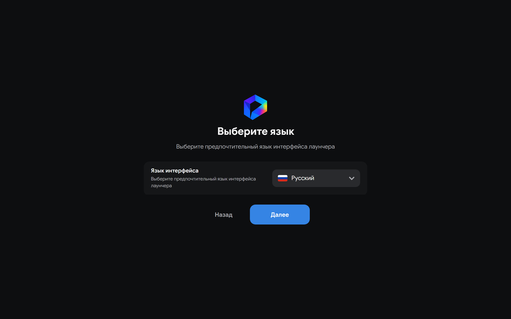
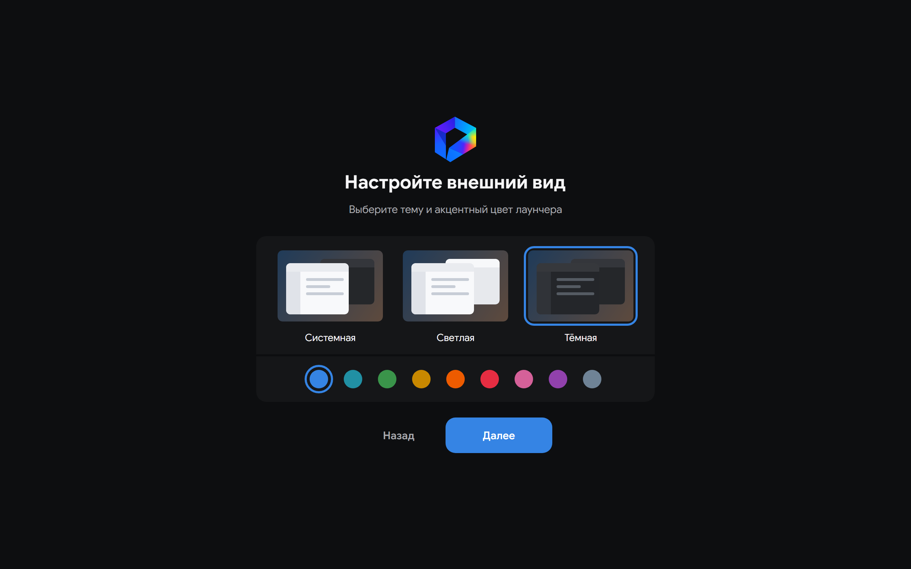
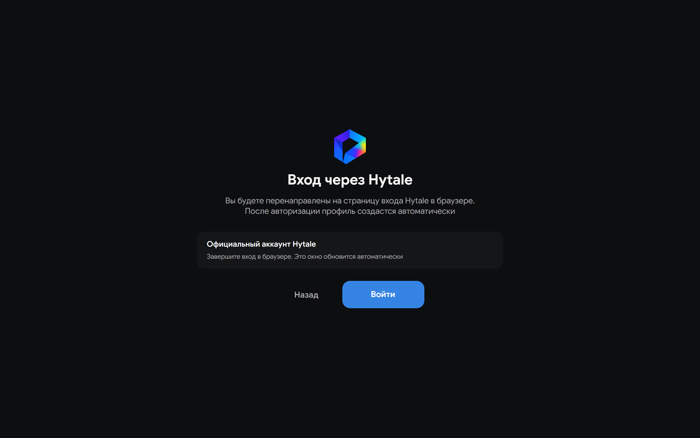
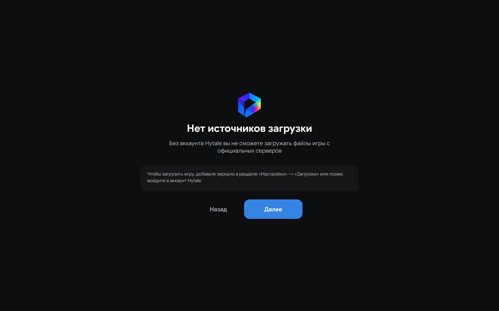
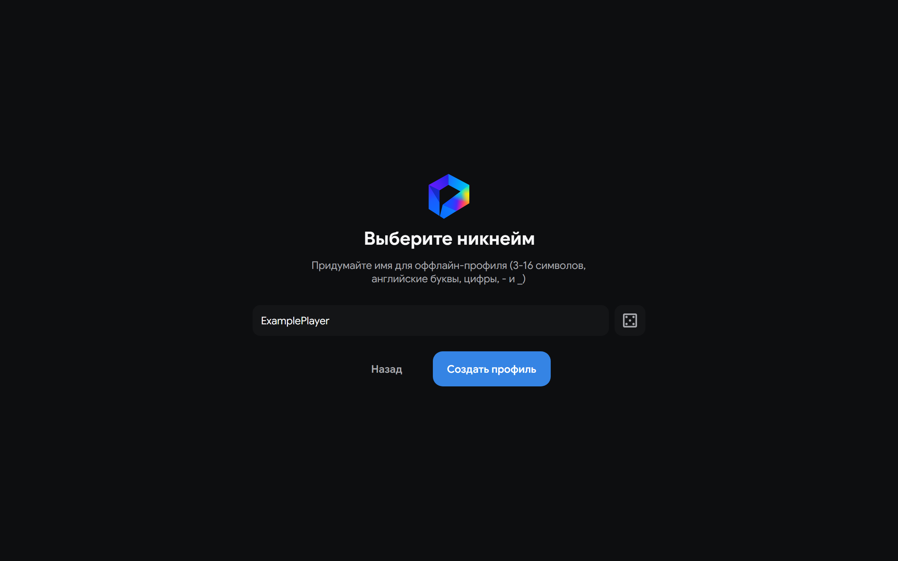

# Первый запуск

На новом устройстве Hyprism открывает мастер настройки после экрана загрузки. Для запуска Hytale нужны профиль игрока и экземпляр игры. Если после обновления уже есть профили или экземпляры, мастер повторно не открывается.

Если старая версия хранила данные в каталоге `HyPrism`, при запуске лаунчер автоматически перенесет их в `Hyprism`. Если существуют оба каталога, порядок их объединения описан на странице [Данные и кэш](/architecture/data-and-cache).

## Завершите первоначальную настройку

1. На экране **Добро пожаловать в Hyprism** нажмите **Далее**.
2. Выберите язык интерфейса. Мастер сразу применит его.
3. Выберите тему и акцентный цвет лаунчера. Позже их можно изменить в разделе **Настройки → Визуал**.
4. Выберите **Официальный аккаунт Hytale** или **Оффлайн-профиль**.

На экране выбора языка показаны текущий язык и его флаг.

На экране оформления показаны варианты темы и доступные акцентные цвета.

На последнем шаге можно выбрать один из двух типов профиля.

**Официальный аккаунт Hytale** открывает вход в системном браузере и требует учетную запись с купленной Hytale. После успешного входа настройка завершается.

Для **Оффлайн-профиля** нужно имя от 3 до 16 латинских букв, цифр, дефисов или символов подчеркивания. Если на новом устройстве нет включенного зеркала, Hyprism сначала предупредит об отсутствии источника загрузки. Нажмите **Далее**, затем введите имя и создайте профиль. Если зеркало уже включено, предупреждение пропускается.

Без официального аккаунта или включенного зеркала нельзя получить список доступных сборок и установить игру. После настройки откройте **Настройки → Загрузки**, нажмите **Добавить** и добавьте источник, которому доверяете. Способы добавления описаны в разделе [Источники загрузки](/user-guide/settings#downloads).

Режимы аутентификации и управление профилями описаны на странице [Профили](/user-guide/profiles).

## Создайте и запустите экземпляр

1. Откройте **Экземпляры**, нажмите **Новый экземпляр** и выберите ветку и сборку.
2. Подтвердите создание. Запись экземпляра появится без загрузки файлов игры.
3. Откройте экземпляр и нажмите **Запустить**. Hyprism загрузит выбранную сборку, подготовит среду выполнения и запустит игру после успешной установки.

Установка, запуск и удаление описаны на странице [Экземпляры](/user-guide/instances-profiles-mods).

Настройки по умолчанию подходят большинству систем. Перед загрузкой проверьте **Настройки → Java**, если нужна своя Java или ограничение памяти, **Настройки → Общие → Используемая видеокарта**, если у вас несколько видеокарт, и **Настройки → Сеть**, если используете оффлайн-профиль.
