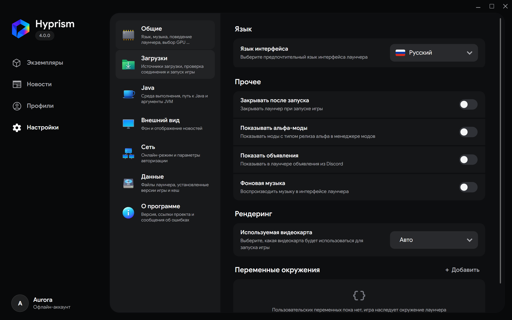
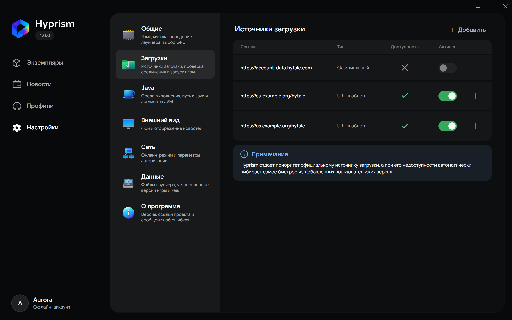

# Настройки

Настройки сгруппированы по назначению. В широком окне категории расположены рядом с содержимым, а в компактном для возврата к списку используется кнопка **Назад**

[](../../../static/img/user/ru/settings-general.png)

## Общие

- **Язык интерфейса** сразу меняет язык лаунчера и страницы завершения официального входа
- **Закрывать после запуска** завершает Hyprism после успешного старта игры
- **Показывать альфа-моды** добавляет предварительные файлы в результаты поиска модов
- **Используемая видеокарта** выбирает найденную видеокарту или оставляет решение системе через **Авто**

Переключатели **Показывать объявления** и **Фоновая музыка** уже есть в интерфейсе, но эти функции пока недоступны в текущей настольной версии

[](../../../static/img/user/ru/settings-gpu-picker.png)

### Переменные окружения

Переменные передаются каждому процессу игры. Добавьте одно или несколько присваиваний `KEY=VALUE`. Значение с пробелами нужно заключить в кавычки

```text
MESA_VK_DEVICE_SELECT=10de:2786
MY_GAME_OPTION="значение с пробелами"
```

Некорректные присваивания отклоняются. Поле краснеет, а причина ошибки появляется под ним и при наведении на значок предупреждения. Пользовательское значение заменяет управляемое лаунчером, если у них совпадает ключ.

## Загрузки {/* #downloads */}

Официальный источник всегда присутствует в настройках. Пользовательские зеркала необязательны, их можно включать, отключать и удалять

[](../../../static/img/user/ru/settings-downloads.png)

Чтобы добавить зеркало, нажмите **Добавить** и выберите способ

- **Автоматическое определение** принимает публичный HTTPS-адрес и пытается определить поддерживаемую структуру
- **Ручная настройка** принимает полное определение `.mirror.json`

Hyprism проверяет определение и наличие файлов для текущей платформы. Лаунчер предпочитает официальный источник, а при его недоступности выбирает самое быстрое включенное зеркало с нужной версией

:::warning
Зеркало поставляет исполняемые файлы игры и патчи. Добавляйте только доверенные адреса и соблюдайте [лицензионное соглашение Hytale](https://hytale.com/eula) и местное законодательство
:::

Формат для ручной настройки описан в [справке по зеркалам](/reference/mirrors)

## Java {/* #java */}

Используйте встроенную среду, если вам не нужна конкретная совместимая установка Java

- **Использовать оригинальную Java** разрешает Hyprism установить и обновлять управляемую среду
- **Кастомная Java** требует выбрать исполняемый файл `java` или `java.exe`
- **Максимум RAM (-Xmx)** и **Начальная RAM (-Xms)** управляют параметрами кучи
- **Расширенные JVM-аргументы** передают дополнительные параметры серверу одиночной игры через `JAVA_TOOL_OPTIONS`

[](../../../static/img/user/ru/java-arguments.png)

Вводите каждый параметр отдельно. Флаги кучи задаются элементами управления памятью и отклоняются в этом редакторе. Если параметр нельзя добавить, поле краснеет, а причина ошибки появляется под ним и при наведении на значок предупреждения.

```text
-Dfile.encoding=UTF-8
-XX:+UnlockExperimentalVMOptions
```

Аргументы агентов, classpath, Java home и выбора исполняемого файла удаляются, потому что могут обходить настройку запуска

## Внешний вид {/* #appearance */}

В категории «Внешний вид» находится переключатель **Отключить новости**. Он пока не останавливает загрузку страницы новостей

## Сеть {/* #network */}

Категория влияет только на офлайн-профили

- **Сетевой режим** отправляет запросы сессии настроенному серверу аутентификации
- **Auth Server** показывает встроенный сервис сессий и добавленные пользователем серверы. Выберите строку, чтобы сделать ее активной, нажмите **Добавить**, введите адрес в overlay-диалоге и подтвердите его после успешной проверки ответа, или удалите пользовательскую строку
- В диалоге добавления указано, что адрес используется для авторизации в онлайн-игре, и показан пример в поле ввода. Если проверка ответа не проходит, поле плавно окрашивается в красный цвет, а иконка предупреждения показывает причину при наведении. Редактирование адреса сбрасывает состояние ошибки
- В таблице используются колонки **Ссылка**, **Доступность** и **Пинг**. В каждой строке отображается состояние доступности в том же стиле, что и у Download sources, включая время ответа доступного сервера
- Список Auth Server скрыт для официального профиля и при выключенном сетевом режиме
- При отключении сетевого режима используется локальный [Local Node](/reference/local-node)

Официальные профили всегда используют официальную аутентификацию Hytale. Сессии Local Node не дают официальную лицензию или централизованные социальные функции

## Данные {/* #data */}

- **Папка экземпляров** меняет место хранения установок игры.
- **Сбросить** возвращает экземпляры в стандартный каталог внутри данных Hyprism
- **Открыть папку** открывает корень экземпляров или полный каталог данных лаунчера
- Диаграмма хранилища группирует экземпляры, моды, изображения, новости, логи и остальные данные

Чтобы изменить расположение, нажмите **Папка экземпляров**, выберите каталог и дождитесь завершения переноса. Hyprism создаст в выбранном каталоге папку `HyprismLibrary` и покажет ее путь как папку экземпляров. Файлы рядом с `HyprismLibrary` останутся на месте. Кнопка **Сбросить** возвращает библиотеку в стандартный каталог.

При смене каталога Hyprism копирует данные и сохраняет права Unix там, где это поддерживается. После успешного переноса удаляется только прежняя папка библиотеки. Если в старой настройке указан общий каталог, Hyprism копирует распознанные экземпляры и оставляет исходный каталог и его файлы на месте. Нельзя выбрать непустую папку `HyprismLibrary`, созданную не Hyprism. Действие недоступно во время работы игры и может быть отменено при копировании.

Перед переносом большого каталога или сменой диска сохраните резервную копию важных миров

## О программе

Раздел показывает установленную версию, последний коммит в `main`, ссылки проекта, участников, лицензии, соглашение Hytale и авторство визуальных материалов

Кнопка **Сообщить об ошибке** открывает шаблоны GitHub. Укажите платформу, версию Hyprism, шаги воспроизведения, ожидаемый и фактический результат, а также подходящие логи
